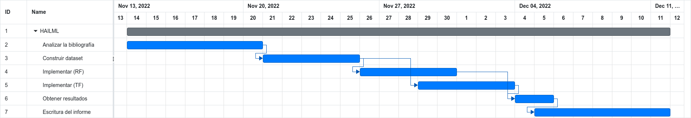

HAILML: Predicción de tormentas de granizo utilizando machine learning
===
Luciano Joaquín Albanes

## Descripción
Este proyecto busca poder predecir que tan probable es que ocurra una tormenta con precipitación de granizo en una determinada zona geográfica utilizando aprendizaje de máquinas (machine learning).

Resulta interesante estudiar este fenómeno, ya que causa grandes perdidas a nivel económico al dañar la producción agrícola en sectores cultivados; o bienes materiales como construcciones, vehículos, herramientas, etc que se encuentren a la intemperie al momento de ocurrir estos fenómenos. Poder predecir este tipo de tormenta implicaría una reducción en estas pérdidas.

## Objetivos
- Interiorizarse sobre el funcionamiento y procesos que ocurren en la atmósfera, para poder lograr una mayor comprensión de ellos.
- Será necesario realizar un estudio de las variables que influyen en la formación de granizo y como llevar a cabo su representación en los datasets.
- Buscar fuentes de datos y recopilar los mismos para construir los datasets de entrenamiento.
- Implementar el modelo mediante el algoritmo de clasificación random forest, _y de forma tentativa una implementación mediante deep learning._

## Limitaciones
El tiempo meteorológico tiene un comportamiento caótico, por lo que las predicciones del mismo no gozan de gran precisión en el mediano y largo plazo. Por ello, el desarrollo de la solución se concentrará en el pronóstico intradiario, con posibilidad de extenderse hasta una semana por delante con la condición de que las predicciones sean útiles.

La zona geográfica con la que se comenzará a trabajar es el Oasis Norte de la Provincia de Mendoza, Argentina; pero como aún no se sabe con certeza las variables y disponibilidad de las mismas, podría llegar a analizarse otra zona geográfica donde también occuriese este fenómeno meteorológico.

## Métrica
El valor de salida del modelo será la probabilidad de que ocurra una tormenta de granizo para un momento y variables meteorológicas dadas, por lo tanto, se trata de un clasificador probabilístico. Para llevar a cabo el entrenamiento se generarán dos dataset: uno de entrenamiento y otro de verificación, con los cuales se podrán obtener métricas para evaluar los modelos generados.

La métrica a utilizar para evaluar el rendimiento de cada modelo será una *Puntuación Brier* (BS). Esta puntuación nos permite cuantificar la precisión de predicciones probabilísticas cuando el valor esperado (de referencia) es un valor binario.

Por ejemplo: Si para un momento dado se obtuvo una probabilidad de tormenta con granizo $P=0.80$, y efectivamente cayó granizo, el puntaje de Brier será $BS=0.20$. Una puntuación $BS=0$ corresponde a una predicción perfecta, mientras que $BS=1$ a una totalmente errónea.

Nuestro objetivo es encontrar un modelo que minimice esta puntuación para todos los valores en el dataset de verificación. Para ello se utilizará la fórmula del error cuadrático medio:

$$ BS = \frac{1}{N} \sum_{t=1}^{N}(f_t - o_t)^2 $$

Donde:
- $N$ es el número de observaciones del dataset de verificación.
- $f_t$ es la probabilidad pronosticada por el modelo.
- $o_t$ es el valor de referencia (1 si cayó granizo, 0 si no)

Además, los modelos obtenidos y de referencia se podrán comparar entre ellos mediante el *índice de habilidad de Brier* (BSS). Este índice nos indica cual es la habilidad relativa entre un modelo y otro de referencia para predecir si cayó o no granizo. Su fórmula es la siguente:

$$ BSS = 1 – \frac{BS}{BS^{ref}} $$ 

Los valores de este índice se interpretan de la siguiente manera:
- $BSS < 0$ El modelo es menos hábil que el de referencia.
- $BSS = 0$ El modelo tiene la misma habilidad que el de referencia.
- $BSS > 0$ El modelo es más hábil que el de referencia.
- $BSS = 1$ El modelo predice a la perfección.

## Justificación
Si bien existen y se utilizan actualmente los modelos numéricos de predicción meteorológica, estos son muy complejos y costosos computacionalmente, por lo que lograr una buena estimación mediante técnicas de machine learning sería positivo. Además, existe una esperanza de que utilizando técnicas de aprendizaje profundo (deep learning) se pueda "hallar" patrones no considerados anteriormente que permitan mejoren las predicciones.

## Fuentes de datos
Asumiendo la viabilidad de realizar este proyecto enfocado en la Provincia de Mendoza, en el [sito web del Servicio Meteorológico Nacional](https://www.smn.gob.ar/descarga-de-datos) se encuentran disponibles las mediciones de datos meteorológicos de varias estaciones ubicadas en la provincia (datos de temperatura, presión, viento y humedad), estos con una frecuencia de una medición por hora, hay disponibilidad de datos desde noviembre del 2017.

También podrían resultar de utilidad mediciones de radares meteorológicos, pronósticos, artículos periodísticos y demás variables por definir. En estos casos será necesario encontrar una fuente de estos datos y agregarlos al dataset.

## Listado de actividades a realizar
1. Analizar la bibliografía relacionada en profundidad, para logar un entendimiento sobre el fenómeno en estudio. [7 días]
2. Buscar recursos donde poder extraer las diversas variables meteorológicas, descargarlas y representarlas en el dataset. [5 días]
3. Implementar y ajustar el modelo de predicción de tormentas de granizo. [5 días]
4. (Tentativa) Implementar y ajustar el modelo de predicción de tormentas de granizo usando TensorFlow. [5 días]
5. Obtener y analizar los resultados y métricas de los modelos. [2 días]
7. Escritura de informe final. [7 días]

## Actividades tentativas
Tentativamente, se implementará y analizará una solución basada en deep learning, utilizando el framework TensorFlow.
Esto conllevaría un estudio previo de los conceptos [1 día], aprender a utilizar el framework [2 días], e implementar y ajustar el modelo [3 días].

## Cronograma estimado de actividades

## Bibliografía relacionada
[Gagne, D.J., McGovern, A., Brotzge, J.A., Coniglio, M., Correia, J., & Xue, M. (2015). Day-Ahead Hail Prediction Integrating Machine Learning with Storm-Scale Numerical Weather Models. _AAAI_.](https://www.researchgate.net/publication/283796331_Day-Ahead_Hail_Prediction_Integrating_Machine_Learning_with_Storm-Scale_Numerical_Weather_Models)

[Gagne, D. J., II, McGovern, A., Haupt, S. E., Sobash, R. A., Williams, J. K., & Xue, M. (2017). Storm-Based Probabilistic Hail Forecasting with Machine Learning Applied to Convection-Allowing Ensembles, _Weather and Forecasting_, _32_(5), 1819-1840.](https://journals.ametsoc.org/view/journals/wefo/32/5/waf-d-17-0010_1.xml)

[Herrera, R. G. (2000). Distribución espacial del granizo en el norte de la provincia de Mendoza, Argentina. Scripta Nova. Revista Electrónica de Geografía y Ciencias Sociales, 4(55-78), UB.](https://revistes.ub.edu/index.php/ScriptaNova/article/view/199)
