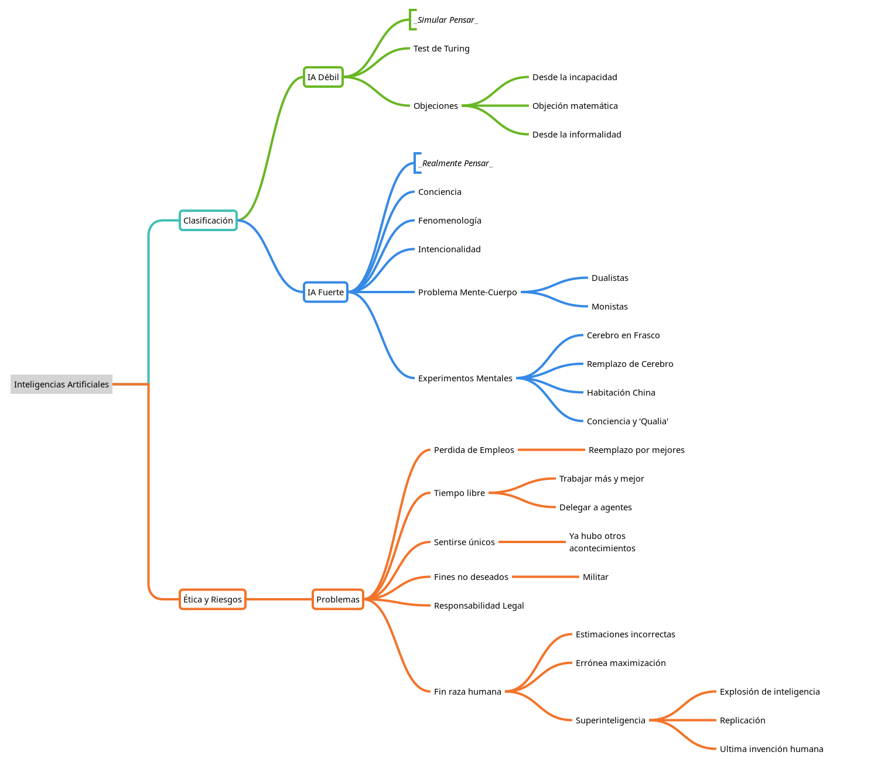

TP1 - Fundamentos
===
# Inteligencia y ética en IAs
Respecto a las Inteligencias Artificiales (IAs), se han presentado muchas preguntas sobre su "inteligencia" (¿Pueden pensar?, ¿Son conscientes?, ¿Qué similitudes tienen con la inteligencia humana?...), y a todo esto, se le suma el análisis de que implicaciones tiene sobre la ética.

Para llevar a cabo un análisis de las cuestiones planteadas anteriormente, se asumen dos tipos de Inteligencias Artificiales: La hipótesis de que las maquinas pueden actuar *como si fuesen* inteligentes se llama **IA Débil**, mientras que la hipótesis de que las maquinas *pueden pensar* (no solamente *simular el pensar*) se llama **IA Fuerte**. 

En la actualidad, los investigadores de las IAs afirman que la IA débil ya ha sido alcanzada, y no se preocupan de la hipótesis de la IA fuerte. Su objetivo es logar que los programas funcionen y resuelvan los problemas de forma eficaz.

## IA Débil 

> “Cada aspecto del aprendizaje o cualquier otra característica de la inteligencia puede ser descrita de forma tan precisa tal que una maquina puede ser hecha para simularla.” - McCarthy et al., 1955

Nuestra definición de Inteligencia Artificial se adecua de forma correcta a el campo de la computación, donde es necesario hallar un buen agente (*Un **agente inteligente**, es una entidad capaz de percibir su entorno, procesar tales percepciones y responder o actuar en su entorno de manera racional, es decir, de manera correcta y tendiendo a maximizar un resultado esperado*) dada una arquitectura específica.

Pero los filósofos se han interesado en otro problema, el de comparar estos agentes con los humanos. Es decir, no plantean el problema de maximizar un resultado, sino que comparan a los humanos con las maquinas, y así responder la siguiente pregunta: **¿Las máquinas pueden pensar?**. 

(*A continuación, se presentan algunos argumentos, contraargumentos y planteos utilizados en el debate de sobre las IAs débiles.*)

Según Edsger Dijkstra, esta comparación es relevante como preguntar si *"los submarinos pueden nadar"*, la definición de *nadar* es: *"Desplazarse por el agua mediante mediante las extremidades, las aletas o la cola"*. La mayoría de las personas concuerdan con que los submarinos no pueden nadar... Pero, si hacemos una analogía con la frase *"los aviones pueden volar"*, siendo la definición de volar: *"Desplazarse por el aire por medio de alas o elementos similares a las alas"*, la mayoría de las personas estarían de acuerdo con que los aviones vuelan.
Ninguna de estas preguntas ni respuestas están relacionadas con las capacidades de los submarinos y aviones, sino que *refieren al uso de las palabras*. (Podríamos decir que para *pensar*, es necesario un cerebro o *algo similar* a un cerebro).

Otro caso nos lo da Alan Turing, sugiriendo que en lugar de preguntarnos si las maquinas pueden pensar, deberíamos someterlas a un test de inteligencia (el Test de Turing). Este test consiste en que un agente tenga una conversación (via chat escrito) con un interrogador humano por 5 minutos. Posteriormente, el interrogador tendrá que adivinar si la conversación que tuvo fue con otro humano o una maquina. En función de la tasa de aciertos de los interrogadores con una maquina en especifico, se podrá decir si pasa o no el Test. Turing conjeturó que tras el pasar de los años, los agentes podrán pasar el test con mayor facilidad.

Ademas, Turing examinó una gran variedad de objeciones a la posibilidad de las maquinas inteligentes, algunas son las siguientes:

### El argumento desde la incapacidad
Este argumento afirma que *las maquinas nunca podrán hacer X*, por ejemplo: _Ser amable, ingeniosa, guapa, simpática, tener iniciativa, tener sentido del humor, distinguir entre el bien y el mal, cometer errores, enamorarse, disfrutar de las frutillas con crema, hacer que alguien se enamore de ella, aprender de la experiencia, usar las palabras correctamente, ser objeto de su propio pensamiento, tener tanta diversidad de comportamiento como el hombre, hacer algo realmente nuevo._

De todas formas, varias de estos ejemplos se han cumplido con posterioridad, una maquina puede cometer errores, jugar al ajedrez y otros juegos, inspeccionar lineas de montaje en fábricas, conducir vehículos, diagnosticar enfermedades de forma igual o mejor que lo haría un humano. También, han realizado pequeños pero significativos descubrimientos en areas como la astronomía, matemáticas, química, biología, etc.

Conociendo a las maquinas, tal vez no es sorprendente que sean brillantes en cuestiones de combinatoria como el ajedrez, pero si lo es que puedan realizar tareas que requieran juicio humano.

Está claro que los ordenadores pueden hacer muchas cosas tan bien o mejor que los humanos, incluso cosas que la gente cree que requieren una gran perspicacia y comprensión humanas. Esto no significa que los ordenadores utilicen la inteligencia y la comprensión en la realización de estas tareas.

### La objeción matemática
Es sabido que ciertas preguntas matemáticas no tienen soluciones en los sistemas formales. (véase la siguiente proposición: _Esta oración es falsa._ ¿Que valor de verdad tiene?)

Turing, entre otros, demostró que hay limitaciones en los sistemas formales que únicamente el hombre conoce; puesto que un computador es un sistema formal, una máquina de Turing, está sujeto a tales limitaciones y hay verdades para el hombre que no son asequibles a la máquina; en consecuencia una máquina no puede imitar el pensamiento humano en su totalidad.

### El argumento desde la informalidad
El "argumento de la informalidad del comportamiento" es la afirmación de que el comportamiento humano es demasiado complejo para ser captado por reglas simples y, por lo tanto, las maquinas nunca podrán ser tan inteligentes como los humanos. Este argumento ha sido expuesto por el filósofo Hubert Dreyfus, que ha escrito una serie de críticas a la inteligencia artificial.

Dreyfus y Dreyfus proponen un proceso de adquisición de experiencia en cinco etapas, que comienza con el procesamiento basado en reglas y termina con la capacidad de seleccionar respuestas correctas de forma instantánea. 

Al hacer esta propuesta, Dreyfus y Dreyfus pasan de ser críticos de la IA a teóricos de la misma: proponen una arquitectura de red neuronal organizada en una amplia "biblioteca de casos", pero señalan varios problemas. Afortunadamente, todos sus problemas han sido abordados y se contemplan en los diseños de agentes de IAs.

## IA Fuerte
*(También conocida como **Inteligencia artificial general**, que podría/puede realizar con éxito cualquier tarea intelectual de cualquier ser humano)*

Muchos filósofos han afirmado que una maquina que pase el Test de Turing, no necesariamente signifique que esté *pensando*, sino que estaría *simulando pensar*.
- Turing, argumenta que para que una maquina pueda pensar, es necesario que tenga **conciencia**, es decir, estar consciente de sus propios estados mentales y acciones.
- Por otro lado, Geoffrey Jefferson, lo relataba como **fenomenología**, o el estudio de la experiencia directa: la máquina tiene que sentir realmente las emociones.
- Otros autores se enfocaban en la **intencionalidad**, es decir, la cuestión de que si las supuestas creencias, deseos y otras representaciones de la máquina son realmente "sobre" algo en el mundo real. 

La respuesta de Turing ante esta objeción es que está tan mal definida como la pregunta: *¿las máquinas pueden pensar?*. Al fin y al cabo, en la vida ordinaria nunca tenemos ninguna evidencia directa sobre los estados mentales internos de otros humanos. Sin embargo, Turing dice: "En lugar de discutir continuamente sobre este punto, es habitual tener la cortés convención de que todo el mundo piensa".

Uno podría pensar que en un futuro, cuando las conversaciones entre humanos y maquinas fuesen algo común, se haría costumbre no hacer una distinción lingüística entre pensamiento *real* y *artificial*.
Se puede hacer la siguiente analogía, ya que algo similar ocurrió en el año 1848 cuando la urea fue sintetizada. Previamente a este hecho, existía una distinción entre la química orgánica e inorgánica, pero una vez se logró la síntesis de la urea, los químicos acordaron que la urea artificial realmente *era* urea.

Volviendo a las IAs. Aún no hemos llegado a nuestro 1848, es más, algunos argumentan que una maquina jamas podrá pensar realmente.

Es una realidad de que no está claro como poder llevar esta analogía a las simulaciones de computadoras sobre los procesos mentales. Véase el siguiente caso: todos estamos de acuerdo en que una *simulación de adición matemática* llevada a cabo en una computadora, *es* una adición real.

### Problema Mente-Cuerpo
El problema mente-cuerpo es el problema de explicar la relación entre la mente y la materia: cómo es que estados mentales o subjetivos (ej. sensaciones, creencias, decisiones, recuerdos) explican a, interactúan con, o bien supervienen de las sustancias y procesos del mundo de objetos (cuerpo).

Este problema es analizado hace siglos, del cual han derivado dos teorías: La **Dualista** y la **Monista**:
- La **Teoría Dualista** dice que el proceso de pensar es algo totalmente ajeno al mundo físico y procesos químicos del cuerpo humano, es decir, que se da de forma separada.
- En cambio, la **Teoría Monista**, llamada también fisicalismo, evita este problema afirmando que la mente no es ajena al cuerpo, sino que todos los estados mentales *son* estados físicos. 

La mayoría de los filósofos de la mente son fisicalistas, lo que permite, en principio, la **posibilidad** de la existencia de **IAs Fuertes**. El problema radica en poder explicar como los *estados físicos* (configuraciones moleculares, procesos electro-químicos, etc) pueden simultáneamente ser *estados mentales*.

### Algunos experimentos mentales
A modo de explicar el significado de los estados mentales, filósofos han propuesto diversos experimentos para así comprender la problemática a la que nos enfrentamos. Algunos ejemplos son los siguientes:

#### Cerebro dentro de un frasco
Si el fisicalismo el correcto, debe haber una combinación de elementos físicos y señales electro-químicas que describan el estado mental de estar por *comer una hamburguesa* (y todos los sentimientos que esto conlleva).

Se presenta un escenario hipotético donde se extrae un cerebro de un cuerpo humano y se lo aloja en un frasco extremadamente sofisticado, en el cual señales eléctricas son dadas al cerebro para simular un mundo enteramente ficticio. 

La vida simulada es una replica exacta de una vida que alguien hubiese vivido, incluyendo la simulación de *comer una hamburguesa*. Por lo tanto: se tendría un estado mental idéntico que alguien que está comiendo una hamburguesa real. Afirmar esto seria literalmente falso, ya que no podría tener el estado mental de *comer una hamburguesa*, no está comiendo una hamburguesa, nunca experimentó ese escenario, y por consecuencia, nunca podría tener ese estado mental.

Esto suena contradictorio, por lo que este dilema se resuelve analizando los estados mentales desde dos puntos de vista:
- El punto de vista del **contenido amplio** lo interpreta desde el punto de vista de un observador externo omnisciente con acceso a toda la situación.
- El **contenido estrecho**, por otro lado, considera sólo el estado del cerebro.

#### Habitación China
Según John Searle (1980), los estados mentales son características emergentes de alto nivel que son causadas por procesos físicos de bajo nivel en las neuronas, y lo que importa son las propiedades (no especificadas) de las neuronas. Por lo tanto, un programa no podría replicar los estados mentales, ya que las maquinas no poseen la misma arquitectura (neuronas).

Para apoyar su idea, plantea el siguiente sistema hipotético: Este consiste en un humano que entiende solamente inglés, con un libro de reglas escrito en inglés (analogía a un CPU). Este sistema está en una habitación aislado, con solamente una rendija que lo comunica con el mundo exterior. El humano recibirá por medio de esa rendija hojas escritas en chino, lo que hará será buscar los símbolos en su libro de reglas, y escribir otros símbolos según lo especifique su libro. Posteriormente, devolverá otra hoja con los símbolos que escribió por medio de la rendija.

Searle explica que la habitación china tiene la capacidad de hacerle creer a la persona que interactúa con ella que comprende el idioma chino, a pesar de que quien está en su interior nunca haya hablado o leído ese idioma. En este momento podemos plantearnos algunas preguntas: 
- ¿Cómo puede el humano responder si no entiende el idioma chino?
- ¿Es el libro de reglas el que sabe chino?
- ¿Es el sistema completo (habitación, humano y libro) el que entiende chino?

Por lo tanto, según Searle, ejecutar el programa correcto no necesariamente genera conocimiento.

Finalizando, para este experimento, Searle se basa en la intuición, no en la demostración: basta con observar la habitación y preguntarse: ¿qué hay allí para ser una mente?

Pero se podría hacer el mismo argumento sobre el cerebro: basta con mirar este conjunto de células (o de átomos), que funcionan ciegamente según las leyes de la bioquímica (o de la física), ¿qué puede haber allí para ser una mente? ¿Por qué un trozo de cerebro puede ser una mente y un trozo de hígado no?... Ese sigue siendo el gran misterio.

### En síntesis
Los argumentos a favor y en contra de las IAs Fuertes son inconclusos. La conciencia permanece como un misterio.

## Ética y Riesgos de desarrollar IAs
Hasta ahora, nos hemos concentrado en si *podemos* desarrollar IAs, pero también deberíamos considerar si *deberíamos*. Muchos de los nuevos desarrollos tecnológicos han tenido efectos secundarios negativos (fisión nuclear, motores de combustión interna, etc).

Respecto al desarrollo de las IAs, se han presentado algunos problemas que van mas allá de los que estamos habituados con otras tecnologías. De todas formas, ya han sido analizados:

### Perdida de empleos debido a la automatización
Por ejemplo, sistemas de créditos de consumo (aplicaciones a tarjetas de crédito, aprobaciones de consumos, detección de fraude) son llevados a cabo por IAs.

De todas formas, las IAs han creado mas trabajos de los que ha eliminado; además, ha creado oficios mas interesantes y mejores pagos.

### La gente podría tener mucho (o poco) tiempo libre
Las IAs aumentan el ritmo de la innovación tecnológica y, por lo tanto, contribuye a aumentar la presión sobre todos para que trabajen más y mejor. Pero, por otro lado, las IAs también nos permiten tomarnos un tiempo libre y dejar que nuestros agentes automatizados se encarguen de algunas cosas.

### La gente podría perder la sensación de sentirse únicos
La humanidad ha sobrevivido a otras situaciones donde se a planteado la perdida a la sensación de unicidad. Véase cuando Copérnico movió a la Tierra por fuera del centro del Sistema Solar; o cuando Darwin puso al Homo Sapiens al mismo nivel que otras especies.

Si las IAs obtienen mucho éxito, esto seria de lo menos preocupante respecto a nuestra moral.

### IAs pueden ser utilizados para fines no deseados
Toda tecnología avanzada a sido utilizada por los poderosos para poder suprimir a sus rivales. Véase los usos que le ha dado a las IAs el ejército estadounidense, diseñando aviones y vehículos terrestres autónomos en Iraq (2009). También es importante mencionar tecnologías de vigilancia de masas, donde algunos afirman que la informatización nos llevará a una perdida de la privacidad
> “You have zero privacy anyway. Get over it.” - Scott McNealy (Sun Microsystems CEO)

### El uso de IAs podría resultar en la perdida de responsabilidad legal
En el ámbito de los litigios, la responsabilidad legal se convierte en un serio problema. Cuando un médico se apoya en el el juicio de una IA médica para un diagnóstico, ¿de quién es la culpa si el diagnóstico es incorrecto?.

Y por otro lado, si los agentes expertos llegan a ser más fiables que los diagnósticos humanos, ¿los médicos podrían ser legalmente responsables *si no utilizan* las recomendaciones de un agente experto?.

### El éxito de las IAs podrían significar el fin de la raza humana
Casi cualquier tecnología tiene el potencial de causar daño en las manos equivocadas, pero las IAs conllevan un nuevo problema, estas manos podría ser la tecnología en si. Por ejemplo:
- Una estimación producida por una IA puede ser incorrecta, y en consecuencia, tomar una mala decisión (Ej: un vehículo autónomo que falle en detectar un semáforo en rojo). Para mitigar estos riesgos, se debería diseñar un sistema que analiza las estimaciones para no permitir que un error se propague por todo el sistema.
- Especificar la correcta función a maximizar puede no ser fácil (Ej: minimizar el sufrimiento humano puede lograrse si no existiesen humanos).
- *Este último ejemplo es exclusivo de las IAs y además el más riesgoso.* Es posible que la función de aprendizaje cause comportamientos indeseados (Superinteligencia Artificial).

#### Superinteligencia Artificial
Definamos una máquina ultra-inteligente (Superinteligencia Artificial) como una máquina que puede superar con creces todas las actividades intelectuales de cualquier hombre por muy inteligente que sea. Por su naturaleza, esta máquina podría diseñar máquinas aún mejores, lo que sería una *explosión de inteligencia*. Por lo tanto, la primer maquina ultra-inteligente sería la ultima invención que el humano necesitaría hacer.

Hay que tener en cuenta que el concepto de máquinas ultra-inteligentes supone que la inteligencia es un atributo especialmente importante y que, si se tiene suficiente, se pueden resolver todos los problemas. Pero sabemos que hay límites en la computabilidad y la complejidad computacional.

# Mapa mental

# Opinión personal
Personalmente, el debate filosófico me resulta muy interesante, pero pienso que no es lo más relevante en nuestro ámbito. En cambio, los riesgos éticos que conllevan la IAs si lo son. Un ejemplo es la problemática y revolución que supondrán los modelos en campos donde se involucre la creatividad humana, como la creación de arte, textos, trabajos cognitivos, etc. A día de hoy se encuentran disponibles modelos de procesamiento del lenguaje natural, modelos de generación de imágenes, etc; que nos permiten realizar tareas que históricamente fueron llevadas a cabo por humanos por estas inteligencias. ¿Esto supondrá que prescindiremos de la creatividad humana? ¿Podrá realizar trabajos cognitivos por nosotros? ¿Es ético que lo haga? ¿Nos estancaríamos a nivel de creatividad? ¿Con que nuevos datos se entrenarían las IAs?. Aquí es donde creo que tenemos que tener cuidado, la evolución de estos sistemas es inevitable, pero tenemos que poder discernir y hacer un uso adecuado de estas nuevas herramientas que tenemos a disposición. Tenemos que utilizarlas para complementar nuestras capacidades, no para remplazarlas.

