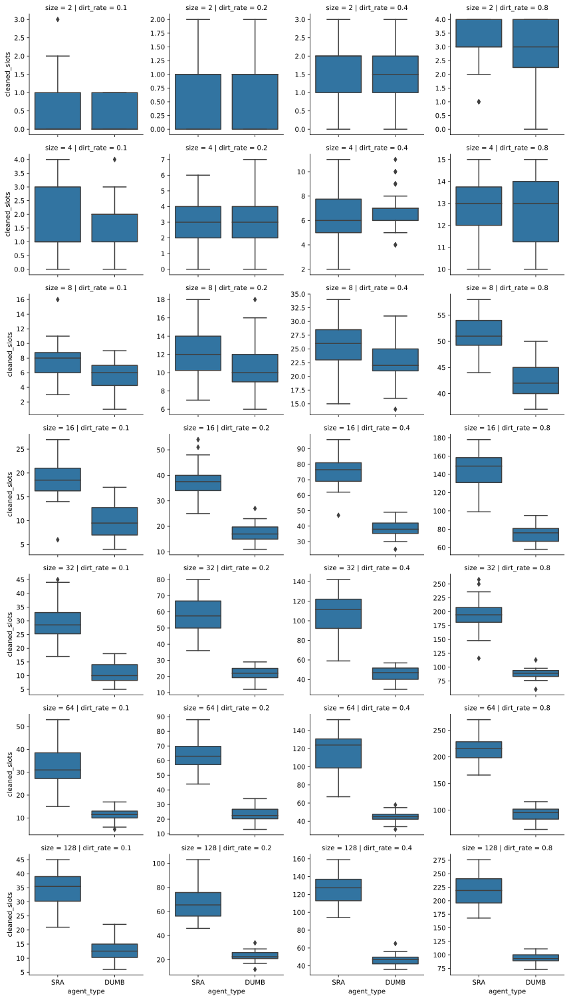
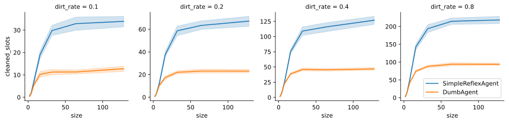

Resultados Agente de Reflejo Simple vs Agente Totalmente aleatorio
===
Se realizaron simulaciones con Agentes de Reflejo Simple (_SimpleReflexAgent_) y Agentes totalmente aleatorios (_DumbAgent_). Las configuraciones utilizadas son las siguientes:
- _tamaño_: 2x2, 4x4, 8x8, 16x16, 32x32, 64x64, 128x128
- _ratio de suciedad_: 0.1, 0,2 0,4, 0.8
- _movimientos disponibles:_ 1000
- _iteraciones por configuración_: 30

> Los archivos *.csv* correspondientes a las tablas se encuentran en la carpeta *attachments*. Además, en la carpeta *code*, se encuentra un Jupyter Notebook para llevar a cabo esta misma simulación, con la posibilidad de alterar la configuración anterior.

# Análisis por categoría
|agent_type       |size|dirt_rate|initial_dirt_avg|initial_dirt_std|cleaned_slots_avg|cleaned_slots_std|cleaned_rate_avg|cleaned_rate_std|remaining_life_avg|remaining_life_std|
|-----------------|----|---------|----------------|----------------|-----------------|-----------------|----------------|----------------|------------------|------------------|
|SimpleReflexAgent|2   |0.1      |0.40            |0.56            |0.40             |0.56             |1.00            |0.00            |998.47            |4.14              |
|SimpleReflexAgent|2   |0.2      |0.90            |0.80            |0.90             |0.80             |1.00            |0.00            |997.27            |4.41              |
|SimpleReflexAgent|2   |0.4      |1.67            |0.88            |1.67             |0.88             |1.00            |0.00            |994.40            |4.91              |
|SimpleReflexAgent|2   |0.8      |3.20            |0.85            |3.20             |0.85             |1.00            |0.00            |988.37            |6.14              |
|SimpleReflexAgent|4   |0.1      |1.60            |1.13            |1.60             |1.13             |1.00            |0.00            |958.53            |43.04             |
|SimpleReflexAgent|4   |0.2      |3.23            |1.81            |3.23             |1.81             |1.00            |0.00            |955.27            |37.43             |
|SimpleReflexAgent|4   |0.4      |6.23            |1.79            |6.23             |1.79             |1.00            |0.00            |928.17            |38.22             |
|SimpleReflexAgent|4   |0.8      |13.03           |1.71            |13.03            |1.71             |1.00            |0.00            |897.37            |48.37             |
|SimpleReflexAgent|8   |0.1      |6.23            |2.94            |6.20             |2.93             |1.00            |0.02            |647.93            |244.16            |
|SimpleReflexAgent|8   |0.2      |13.27           |3.50            |13.20            |3.53             |0.99            |0.03            |405.30            |235.20            |
|SimpleReflexAgent|8   |0.4      |24.83           |3.09            |24.73            |3.14             |1.00            |0.01            |384.53            |244.97            |
|SimpleReflexAgent|8   |0.8      |51.27           |4.07            |50.97            |4.11             |0.99            |0.01            |289.20            |213.90            |
|SimpleReflexAgent|16  |0.1      |25.37           |4.85            |18.80            |4.44             |0.74            |0.12            |0.00              |0.00              |
|SimpleReflexAgent|16  |0.2      |51.53           |6.82            |37.70            |7.55             |0.73            |0.12            |0.00              |0.00              |
|SimpleReflexAgent|16  |0.4      |104.33          |8.91            |72.07            |11.76            |0.69            |0.10            |0.00              |0.00              |
|SimpleReflexAgent|16  |0.8      |203.80          |6.34            |138.13           |20.55            |0.68            |0.10            |0.00              |0.00              |
|SimpleReflexAgent|32  |0.1      |102.33          |11.72           |27.10            |7.42             |0.26            |0.07            |0.00              |0.00              |
|SimpleReflexAgent|32  |0.2      |210.03          |14.56           |56.40            |14.71            |0.27            |0.07            |0.00              |0.00              |
|SimpleReflexAgent|32  |0.4      |409.90          |16.10           |107.20           |21.20            |0.26            |0.05            |0.00              |0.00              |
|SimpleReflexAgent|32  |0.8      |822.83          |13.59           |189.00           |35.17            |0.23            |0.04            |0.00              |0.00              |
|SimpleReflexAgent|64  |0.1      |409.60          |24.13           |34.07            |9.02             |0.08            |0.02            |0.00              |0.00              |
|SimpleReflexAgent|64  |0.2      |821.13          |23.71           |61.77            |13.34            |0.08            |0.02            |0.00              |0.00              |
|SimpleReflexAgent|64  |0.4      |1635.63         |36.69           |118.80           |17.91            |0.07            |0.01            |0.00              |0.00              |
|SimpleReflexAgent|64  |0.8      |3279.10         |24.08           |218.27           |34.86            |0.07            |0.01            |0.00              |0.00              |
|SimpleReflexAgent|128 |0.1      |1643.17         |34.48           |34.17            |5.84             |0.02            |0.00            |0.00              |0.00              |
|SimpleReflexAgent|128 |0.2      |3264.53         |56.28           |65.97            |13.41            |0.02            |0.00            |0.00              |0.00              |
|SimpleReflexAgent|128 |0.4      |6541.70         |60.18           |120.80           |13.97            |0.02            |0.00            |0.00              |0.00              |
|SimpleReflexAgent|128 |0.8      |13113.80        |46.58           |231.83           |22.00            |0.02            |0.00            |0.00              |0.00              |
|DumbAgent        |2   |0.1      |0.53            |0.63            |0.53             |0.63             |1.00            |0.00            |986.83            |25.92             |
|DumbAgent        |2   |0.2      |0.80            |0.81            |0.80             |0.81             |1.00            |0.00            |975.73            |48.02             |
|DumbAgent        |2   |0.4      |1.77            |0.90            |1.77             |0.90             |1.00            |0.00            |966.73            |32.80             |
|DumbAgent        |2   |0.8      |3.20            |0.85            |3.20             |0.85             |1.00            |0.00            |955.00            |35.16             |
|DumbAgent        |4   |0.1      |1.50            |1.04            |1.50             |1.04             |1.00            |0.00            |828.90            |163.95            |
|DumbAgent        |4   |0.2      |3.27            |1.44            |3.27             |1.44             |1.00            |0.00            |751.27            |113.58            |
|DumbAgent        |4   |0.4      |6.07            |1.96            |6.07             |1.96             |1.00            |0.00            |662.30            |175.83            |
|DumbAgent        |4   |0.8      |13.07           |1.46            |12.97            |1.47             |0.99            |0.02            |535.27            |233.93            |
|DumbAgent        |8   |0.1      |6.53            |2.18            |5.43             |1.77             |0.84            |0.14            |131.67            |230.73            |
|DumbAgent        |8   |0.2      |12.70           |3.42            |10.90            |3.33             |0.85            |0.11            |48.57             |116.53            |
|DumbAgent        |8   |0.4      |26.03           |3.34            |22.20            |3.98             |0.85            |0.07            |0.00              |0.00              |
|DumbAgent        |8   |0.8      |50.30           |3.16            |43.13            |3.98             |0.86            |0.05            |0.00              |0.00              |
|DumbAgent        |16  |0.1      |25.83           |4.94            |9.80             |2.89             |0.39            |0.11            |0.00              |0.00              |
|DumbAgent        |16  |0.2      |51.47           |4.88            |18.80            |4.56             |0.36            |0.07            |0.00              |0.00              |
|DumbAgent        |16  |0.4      |102.97          |7.33            |38.47            |6.36             |0.37            |0.05            |0.00              |0.00              |
|DumbAgent        |16  |0.8      |205.07          |5.55            |75.93            |8.33             |0.37            |0.04            |0.00              |0.00              |
|DumbAgent        |32  |0.1      |101.23          |8.81            |10.60            |2.82             |0.11            |0.03            |0.00              |0.00              |
|DumbAgent        |32  |0.2      |202.83          |11.53           |21.97            |6.34             |0.11            |0.03            |0.00              |0.00              |
|DumbAgent        |32  |0.4      |409.23          |14.48           |44.37            |7.94             |0.11            |0.02            |0.00              |0.00              |
|DumbAgent        |32  |0.8      |821.80          |11.06           |90.40            |10.24            |0.11            |0.01            |0.00              |0.00              |
|DumbAgent        |64  |0.1      |413.30          |15.97           |11.53            |3.99             |0.03            |0.01            |0.00              |0.00              |
|DumbAgent        |64  |0.2      |817.77          |22.22           |22.80            |4.25             |0.03            |0.01            |0.00              |0.00              |
|DumbAgent        |64  |0.4      |1630.67         |37.13           |45.27            |7.46             |0.03            |0.00            |0.00              |0.00              |
|DumbAgent        |64  |0.8      |3287.00         |22.38           |93.50            |10.07            |0.03            |0.00            |0.00              |0.00              |
|DumbAgent        |128 |0.1      |1641.90         |31.60           |12.47            |4.60             |0.01            |0.00            |0.00              |0.00              |
|DumbAgent        |128 |0.2      |3265.80         |52.20           |22.97            |5.96             |0.01            |0.00            |0.00              |0.00              |
|DumbAgent        |128 |0.4      |6545.83         |56.64           |48.57            |6.75             |0.01            |0.00            |0.00              |0.00              |
|DumbAgent        |128 |0.8      |13104.37        |50.48           |95.33            |9.54             |0.01            |0.00            |0.00              |0.00              |

# Gráficos
## Boxplot
En el siguiente gráfico se observa el comportamiento de cada agente para cada una de las posibles combinaciones de *tamaño* y *ratio de suciedad*. La variable que se evalúa es el el ratio de limpieza (*cleaned_rate*), que se define como $cleaned\_rate = \frac{cleaned\_slots}{initial\_dirt}$

# Lineplot
En este gráfico, se analiza como evoluciona para cada agente el *cleaned_rate* a medida que aumenta el tamaño de la grilla. Un gráfico por *ratio de suciedad*. Eje vertical en escala logarítmica.

