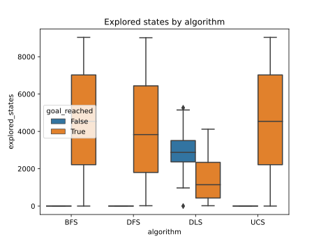
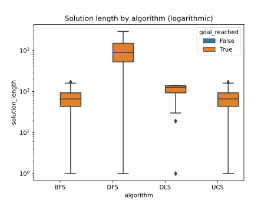

Resultados: Agentes basados en objetivos, mediante búsqueda no informada
===
Se realizaron simulaciones con agentes basados en objetivos mediante búsqueda no informada. La configuración utilizada es la siguiente:
- _algoritmos:_ [búsqueda en anchura, búsqueda por profundidad, búsqueda por profundidad limitada, búsqueda de costo uniforme]
- _tamaño:_ 100x100
- _tasa de obstáculos:_ 0.1
- _profundidad (solo para búsqueda por profundidad limitada):_ 142
- _cantidad de entornos:_ 300*

La medida de rendimiento a analizar es la cantidad de slots explorados previos a llegar a un estado objetivo. Además, se analiza una segunda medida, el tamaño de la solución encontrada.

_*Se iteró una mayor cantidad de veces que lo solicitado para reducir el error en las variables analizadas._

> Los archivos *.csv* correspondientes a las tablas se encuentran en la carpeta *attachments*. Además, en la carpeta *code*, se encuentra un Jupyter Notebook para llevar a cabo esta misma simulación, con la posibilidad de alterar la configuración anterior.

# Análisis por categoría
|algorithm   |goal_reached_n|solution_length_avg|solution_length_std|explored_states_avg|explored_states_std|
|------------|--------------|-------------------|-------------------|-------------------|-------------------|
|GoalAgentBFS|299           |69,33              |35,88              |4574,82            |2670,88            |
|GoalAgentDFS|299           |1028,32            |667,70             |4150,66            |2690,36            |
|GoalAgentDLS|82            |30,30              |52,78              |2501,39            |1150,44            |
|GoalAgentUCS|299           |69,33              |35,88              |4574,82            |2670,88            |

# Gráficos
## Boxplot - Estados explorados
En el siguiente gráfico se observa la distribución de la cantidad de estados explorados (_explored_states_) por cada algoritmo (_algorithm_), distinguiendo cuando el objetivo fue alcanzado o no (_goal_reached_)

## Boxplot - Tamaño de la solución
En este gráfico, se analiza el tamaño de las soluciones (_solution_length_) encontradas por cada algoritmo (_algorithm_). Adicionalmente, se agrega el mismo gráfico, pero con el eje vertical en escala logarítmica.

# Análisis de los resultados - Algoritmo óptimo para el problema
Según los resultados obtenidos, se concluye lo siguiente:
- BFS y UCS actúan de forma idéntica, ya que el problema no tiene costos.
- DFS explora una cantidad de estados similar que BFS y UCS, pero es subóptimo al encontrar las soluciones.
- Respecto a DLS, solo encuentra soluciones cuando el objetivo esta a una distancia menor o igual a la dada por el límite. No presenta mejoras en el tamaño de la solución del problema respecto a BFS y UCS.

Por lo tanto, la solución ideal el problema planteado es la búsqueda por profundidad (BFS). Esto se debe a que es óptimo y completo y la cantidad de estados explorados es tratable computacionalmente.
El algoritmo de búsqueda de costo uniforme (UCS) es equivalente a BFS, pero como este problema no tiene costos, UCS conlleva una leve mayor complejidad temporal, ya que utiliza una cola por prioridad (implementada mediante un min-heap), la comprobación y cálculo de costos.
