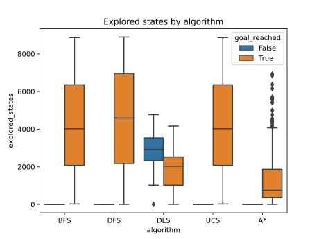
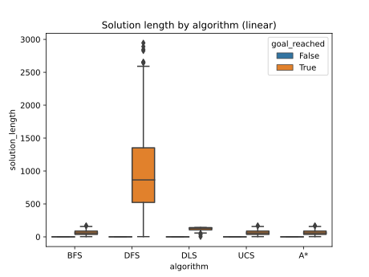
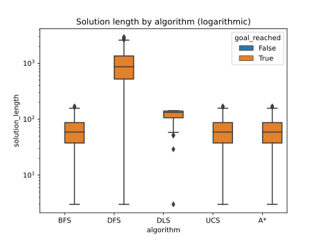

Resultados: Agentes basados en objetivos, mediante búsqueda informada (A*) y no informada.
===
Se realizaron simulaciones con agentes basados en objetivos mediante búsqueda informada y no informada. La configuración utilizada es la siguiente:
- _algoritmos:_ [búsqueda en anchura, búsqueda por profundidad, búsqueda por profundidad limitada, búsqueda de costo uniforme, búsqueda A*]
- _tamaño:_ 100x100
- _tasa de obstáculos:_ 0.1
- _profundidad (solo para búsqueda por profundidad limitada):_ 142
- _cantidad de entornos:_ 300*

La medida de rendimiento a analizar es la cantidad de slots explorados previos a llegar a un estado objetivo. Además, se analiza una segunda medida, el tamaño de la solución encontrada.

_*Se iteró una mayor cantidad de veces que lo solicitado para reducir el error en las variables analizadas._

> Los archivos *.csv* correspondientes a las tablas se encuentran en la carpeta *attachments*. Además, en la carpeta *code*, se encuentra un Jupyter Notebook para llevar a cabo esta misma simulación, con la posibilidad de alterar la configuración anterior.

# Análisis por categoría
|algorithm     |goal_reached_n|solution_length_avg|solution_length_std|explored_states_avg|explored_states_std|
|--------------|--------------|-------------------|-------------------|-------------------|-------------------|
|GoalAgentBFS  |299           |64,36              |34,09              |4208,17            |2555,36            |
|GoalAgentDFS  |299           |1014,34            |651,20             |4558,14            |2601,48            |
|GoalAgentDLS  |93            |36,40              |56,87              |2593,38            |1032,67            |
|GoalAgentUCS  |299           |64,36              |34,09              |4208,17            |2555,36            |
|GoalAgentAStar|299           |64,36              |34,09              |1304,43            |1394,99            |

# Gráficos
## Boxplot - Estados explorados
En el siguiente gráfico se observa la distribución de la cantidad de estados explorados (_explored_states_) por cada algoritmo (_algorithm_), distinguiendo cuando el objetivo fue alcanzado o no (_goal_reached_).

## Boxplot - Tamaño de la solución
En este gráfico, se analiza el tamaño de las soluciones (_solution_length_) encontradas por cada algoritmo (_algorithm_). Adicionalmente, se agrega el mismo gráfico, pero con el eje vertical en escala logarítmica.

# Análisis de los resultados - búsqueda informada contra no informada
Según los resultados obtenidos, se aprecia una significativa diferencia en la cantidad de estados explorados a favor del algoritmo A*. Este es capaz de encontrar el camino óptimo (al igual que BFS y UCS), pero de forma más eficiente.
