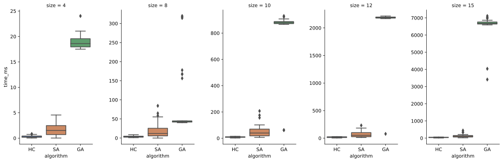
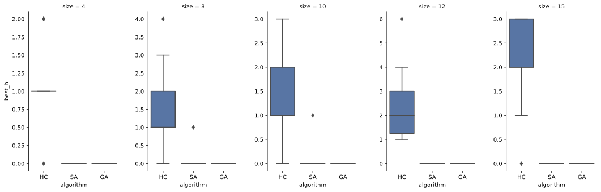

Resultados: Búsqueda Local - N-Reinas
===
# Tiempo de ejecución
Se realizaron simulaciones con agentes basados en objetivos mediante búsqueda local para hallar tableros soluciones al problema de las $n$ reinas. La configuración utilizada es la siguiente:
- _algoritmos:_ [Hill climbing, Simulated annealing, Algorítmo genético]
- _tamaños:_ $[4, 8, 10, 12, 15]$
- _límite de estados evaluados:_ $size^4$
- _cantidad de iteraciones:_ $30$

Cada tablero se evalúa en función de la cantidad de pares de reinas que se encuentran bajo amenaza.

> Los archivos *.csv* correspondientes a las tablas se encuentran en la carpeta *attachments*. Además, en la carpeta *code*, se encuentra un Jupyter Notebook para llevar a cabo esta misma simulación, con la posibilidad de alterar la configuración anterior.

## Análisis por algorítmo y tamaño
|algorithm          |size|optimal_rate|h_reached_avg|h_reached_std|time_ms_avg|time_ms_std|iter_avg|iter_std|
|-------------------|----|------------|-------------|-------------|-----------|-----------|--------|--------|
|hill_climbing      |4   |0,07        |1,17         |0,53         |0,56       |0,34       |24,80   |17,24   |
|hill_climbing      |8   |0,03        |1,63         |0,93         |4,49       |3,98       |188,53  |111,50  |
|hill_climbing      |10  |0,03        |1,57         |0,86         |12,15      |6,18       |501,00  |226,31  |
|hill_climbing      |12  |0,00        |2,17         |1,09         |20,54      |9,36       |765,60  |350,78  |
|hill_climbing      |15  |0,07        |2,13         |0,82         |61,08      |26,31      |1659,00 |500,46  |
|simulated_annealing|4   |1,00        |0,00         |0,00         |3,08       |2,33       |105,43  |64,73   |
|simulated_annealing|8   |0,97        |0,03         |0,18         |22,76      |24,36      |750,60  |865,96  |
|simulated_annealing|10  |0,97        |0,03         |0,18         |61,81      |78,03      |1893,13 |2187,34 |
|simulated_annealing|12  |1,00        |0,00         |0,00         |95,90      |76,49      |2925,13 |2437,41 |
|simulated_annealing|15  |1,00        |0,00         |0,00         |120,74     |115,51     |2767,23 |2545,50 |
|genetic_algorithm  |4   |1,00        |0,00         |0,00         |1,45       |0,46       |50,00   |0,00    |
|genetic_algorithm  |8   |1,00        |0,00         |0,00         |13,95      |9,67       |220,00  |134,93  |
|genetic_algorithm  |10  |1,00        |0,00         |0,00         |44,38      |21,81      |558,33  |265,58  |
|genetic_algorithm  |12  |1,00        |0,00         |0,00         |110,53     |90,02      |1070,00 |802,86  |
|genetic_algorithm  |15  |1,00        |0,00         |0,00         |233,63     |100,28     |1503,33 |548,97  |

## Boxplot - Tiempo de ejecución
En el siguiente gráfico se observa el tiempo de ejecución (en milisegundos) (_time_ms_) por cada algoritmo (_algorithm_), diferenciando entre los distintos tamaños de los tableros (_size_).

## Boxplot - Mejor $h()$ alcanzado
En el siguiente gráfico, se observa que tan buenas son las soluciones halladas (_best_h_) por cada algoritmo (_algorithm_), diferenciando entre los distintos tamaños de los tableros (_size_).

# Comportamiento de $h()$
Se realizaron simulaciones con los agentes anteriormente tratados, analizando como evoluciona el valor de $h()$ tras cada iteración:
La configuración se modificó de la siguiente manera:
- _tamaño:_ $24$
- _límite de estados evaluados:_ $5000$

# Análisis de los resultados
Analizando los resultados obtenidos, se aprecia que los dos algoritmos admisibles son Simulated Annealing (SA) y Algoritmo Genético (AG), ya que en estos es altamente probable hallar soluciones para el problema. 
Respecto a los dos algoritmos que seleccioné, se observa que a medida que el tamaño de los tableros aumentan, el tiempo de ejecución de GA crece en mayor medida que el de SA. Esto se debe a que el algoritmo genético fue implementado sin paralelización. Si se hubiese optado por una implementación paralelizada, el tiempo de ejecución de GA sería menor. Por lo tanto, la elección del algoritmo se verá condicionada a la posibilidad de paralelización en el sistema donde se quiera aplicar el software.

# Detalles de implementación
A continuación, se mencionan algunos detalles de relevancia de como fueron implementados los algoritmos tratados anteriormente:

- Ningún algoritmo utiliza paralelización. Se podría haber utilizado e implementado en Hill climbing y Algoritmo Genético, aumentando el speedup de ambos.

## Hill climbing
- Se implementó la función $h$ de manera que pueda reutilizar los resultados de $h$ anteriores y así evitar recalcular ataques entre reinas que no se vieron modificadas después de un movimiento dado.

## Simulated annealing
- El enfriamiento está modelado mediante una progresión geométrica. ( $T_{t+1} = \alpha*T_{t}$ ).
- Se utilizaron los parámetros: $T_{0} = 700$ y $\alpha = 0.95$.
- También se aprovechó de la implementación optimizada de $h$.

## Algoritmo genético
- El tamaño de la población es constante y es $n=50$.
- El remplazo se lleva a cabo manteniendo los 20 mejores individuos del conjunto conformado por la población anterior y la nueva.
- Los padres se obtienen por selección proporcional de acuerdo a su fitness.
- La probabilidad de mutación se limita a un gen por cromosoma y es $P(m)=0.05$.
- El crossover se realiza mediante un cruce de orden (1).
