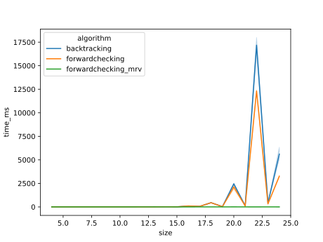

Constraint Satisfaction Problems
===
# Actividad 1
Describir en detalle una formulación CSP para el Sudoku.
---

El Sudoku es un puzzle conformado por un tablero de $9×9$ celdas ( $81$ casilleros) dividida en subcuadrículas de $3×3$. Algunos de los casilleros ya se encuentran con valores asignados y será nuestra tarea completar los restantes casilleros de forma que se satisfagan ciertas restricciones:
	1. Un número no se puede repetír en una misma fila.
	2. Un número no se puede repetír en una misma columna. 
	3. Un número no se puede repetír en una misma subcuadrícula. 


Este problema se puede tratar mediante algorítmos de resolución de CSP. La formulación del problema es la siguiente:

- $X$ es el conjunto de variables. Al tener un tablero de $9×9$, a cada casillero le corresponde a una variable ( $n=81$ ):

	$$ X=\{A1, A2, A3, ..., I7, I8, I9\} $$
	
- $D$ es el dominio de cada variable vacias. Las variables que ya poseen valores tienen el dominio restringido a dicho valor: 

	$$ D=\{1,2,3,4,5,6,7,8,9\} $$

- $C$ es el conjunto de restricciones, está conformado por $27$ restricciones de orden superior (*TodosDifieren*), $9$ para cada fila, $9$ para cada columna, y $9$ para cada subcuadrícula:

	$$
	\begin{aligned}
	C = \{ \
	TodosDifieren (A1, A2, A3, A4, A5, A6, A7, A8, A9) \\
	TodosDifieren (B1, B2, B3, B4, B5, B6, B7, B8, B9) \\
	··· \\
	TodosDifieren (A1, B1, C1, D1, E1, F 1, G1, H1, I1) \\
	TodosDifieren (A2, B2, C2, D2, E2, F 2, G2, H2, I2) \\
	··· \\
	TodosDifieren (A1, A2, A3, B1, B2, B3, C1, C2, C3) \\
	TodosDifieren (A4, A5, A6, B4, B5, B6, C4, C5, C6) \\
	··· \}
	\end{aligned}
	$$

Respecto al algoritmo a utilizar, sería una implementación basada en backtracking. Donde las variables se seleccionan mediante MRV (variable mas restringida), los valores mediante LCV (valor menos restringido), y antes de cada asignación, se realizará un chequeo hacia adelante mediante MAC (AC-3).

# Actividad 2
Utilizar el algoritmo AC-3 para demostrar que la arco consistencia puede detectar la inconsistencia de la asignación parcial $\{WA=red, V=blue\}$ para el problema del colorar el mapa de Australia *(Figura 5.1 AIMA 2da edición)*.
---


Se llevará a cabo una propagación de restricciones mediante el algoritmo AC-3, paso a paso, para demostrar que la asignación WA=red, V=blue es inconsistente.

## Paso a paso
1. Estado inicial. 
	1. Asignar *WA=red*.
	2. Asignar *V=blue*.

2. Se extrae de la cola *(WA-NT)*
	1. Para *WA=red -> NT=green.*
	2. Continuar.

3. Se extrae de la cola *(NT-WA)*
	1. No existe valor en *WA* para *NT=red* -> Eliminar *NT=red*.
	2. Para *NT=green -> WA=red*.
	3. Para *NT=blue -> WA=red*.
	4. Agregar a la cola las aristas incidentes a *NT* (excepto *(WA-NT)*): [(SA-NT), (Q-NT)].

4. Se extrae de la cola *(WA-SA)*
	1. Para *WA=red -> SA=green.*
	2. Continuar.

5. Se extrae de la cola *(SA-WA)*
	1. No existe valor en *WA* para *SA=red* -> Eliminar *SA=red*.
	2. Para *SA=green -> WA=red*.
	3. Para *SA=blue -> WA=red*.
	4. Agregar a la cola las aristas incidentes a *SA* (excepto *(WA-SA)*): [(NT-SA), (Q-SA), (NSW-SA), (V-SA)].

6. Se extrae de la cola *(NT-SA)*
	1. Para *NT=green -> SA=blue*.
	2. Para *NT=blue -> SA=green*.
	3. Continuar.

7. Se extrae de la cola *(SA-NT)*
	1. Para *SA=green -> NT=blue*.
	2. Para *SA=blue -> NT=green*.
	3. Continuar.

8. Se extrae de la cola *(NT-Q)*
	1. Para *NT=green -> Q=red*.
	2. Para *NT=blue -> Q=red*.
	3. Continuar.

9. Se extrae de la cola *(Q-NT)*
	1. Para *Q=red -> NT=green*.
	2. Para *Q=green -> NT=blue*.
	3. Para *Q=blue -> NT=green*.
	4. Continuar.

10. Se extrae de la cola *(SA-Q)*
	1. Para *SA=green -> Q=red*.
	2. Para *SA=blue -> Q=red*.
	3. Continuar.

11. Se extrae de la cola *(Q-SA)*
	1. Para *Q=red -> SA=green*.
	2. Para *Q=green -> SA=blue*.
	3. Para *Q=blue -> SA=green*.
	4. Continuar.

12. Se extrae de la cola *(SA-NSW)*
	1. Para *SA=green -> NSW=red*.
	2. Para *SA=blue -> NSW=red*.
	3. Continuar.

13. Se extrae de la cola *(NSW-SA)*
	1. Para *NSW=red -> SA=green*.
	2. Para *NSW=green -> SA=blue*.
	3. Para *NSW=blue -> SA=green*.
	4. Continuar.

14. Se extrae de la cola *(SA-V)*
	1. Para *SA=green -> V=blue*.
	2. No existe valor en *V* para *SA=blue* -> Eliminar *SA=blue*.
	3. Agregar a la cola las aristas incidentes a *SA* (excepto *(V-SA)*): [(WA-SA), (NT-SA), (Q-SA), (NSW-SA)].

15. Se extrae de la cola *(V-SA)*
	1. Para *V=blue -> SA=Green.*
	2. Continuar.

16. Se extrae de la cola *(Q-NSW)*
	1. Para *Q=red -> NSW=green.*
	2. Para *Q=green -> NSW=red.*
	3. Para *Q=blue -> NSW=red.*
	4. Continuar.

17. Se extrae de la cola *(NSW-Q)*
	1. Para *NSW=red -> Q=green.*
	2. Para *NSW=green -> Q=red.*
	3. Para *NSW=blue -> Q=red.*
	4. Continuar.

18. Se extrae de la cola *(NSW-V)*
	1. Para *NSW=red -> V=blue*.
	2. Para *NSW=green -> V=blue*.
	3. No existe valor en *V* para *NSW=blue* -> Eliminar *NSW=blue*.
	4. Agregar a la cola las aristas incidentes a *NSW* (excepto *(V-NSW)*): [(Q-NSW), (SA-NSW)].

19. Se extrae de la cola *(V-NSW)*
	1. Para *V=blue -> NSW=red.*
	2. Continuar.

20. Se extrae de la cola *(SA-NT)*
	1. Para *SA=green -> NT=blue.*
	2. Continuar.

21. Se extrae de la cola *(Q-NT)
	1. Para *Q=red -> NT=green*.
	2. Para *Q=green -> NT=blue*.
	3. Para *Q=blue -> NT=green*.
	4. Continuar.

22. Se extrae de la cola *(NT-SA)*
	1. Para *NT=blue -> SA=green*.
	2. No existe valor en *SA* para *NT=green* -> Eliminar *NT=green*.
	3. Agregar a la cola las aristas incidentes a *NT* (excepto *(SA-NT)*): [(WA-NT), (Q-NT)].

23. Se extrae de la cola *(Q-SA)*
	1. Para *Q=red -> SA=green*
	2. No existe valor en *SA* para *Q=green* -> Eliminar *Q=green*.
	3. Para *Q=blue -> SA=green*
	4. Agregar a la cola las aristas incidentes a *Q* (excepto *(SA-Q)*): [(NT-Q), (NSW-Q)].

24. Se extrae de la cola *(NSW-SA)*
	1. Para *NSW=red -> SA=green*.
	2. No existe valor en *SA* para *NSW=green* -> Eliminar *NSW=green*.
	3. Agregar a la cola las aristas incidentes a *NSW* (excepto *(SA-NSW)*): [(Q-NSW), (V-NSW)].

25. Se extrae de la cola *(V-SA)*
	1. Para *V=blue -> SA=green.*
	2. Continuar.

26. Se extrae de la cola *(WA-SA)*
	1. Para *WA=red -> SA=green.*
	2. Continuar.

27. Se extrae de la cola *(NT-SA)*
	1. Para *NT=blue -> SA=green.*
	2. Continuar.

28. Se extrae de la cola *(Q-SA)*
	1. Para *Q=red -> SA=green*
	2. Para *Q=blue -> SA=green*
	3. Continuar.

29. Se extrae de la cola *(NSW-SA)*
	1. Para *NSW=red -> SA=green*
	2. Continuar.

30. Se extrae de la cola *(Q-NSW)*
	1. No existe valor en *NSW* para *Q=red* -> Eliminar *Q=red*.
	2. Para *Q=blue -> NSW=red*
	3. Agregar a la cola las aristas incidentes a *Q* (excepto *(NSW-Q)*): [(NT-Q), (SA-Q)].

31. Se extrae de la cola *(SA-NSW)*
	1. Para *SA=green -> NSW=red*
	2. Continuar.

32. Se extrae de la cola *(WA-NT)*
	1. Para *WA=red -> NT=blue*
	2. Continuar.

33. Se extrae de la cola *(Q-NT)*
	1. No existe valor en *NT* para *Q=blue* -> Eliminar *Q=blue*.
	2. **SE DETECTA QUE LA VARIABLE *Q* QUEDÓ CON DOMINIO VACÍO.** -> Finalizar


## Tabla de restricciones


## Estados de la cola
Q(1). = [(WA-NT), (NT-WA), (WA-SA), (SA-WA), (NT-SA), (SA-NT), (NT-Q), (Q-NT), (SA-Q), (Q-SA), (SA-NSW), (NSW-SA), (SA-V), (V-SA), (Q-NSW), (NSW-Q), (NSW-V), (V-NSW)]

Q(2). = [(NT-WA), (WA-SA), (SA-WA), (NT-SA), (SA-NT), (NT-Q), (Q-NT), (SA-Q), (Q-SA), (SA-NSW), (NSW-SA), (SA-V), (V-SA), (Q-NSW), (NSW-Q), (NSW-V), (V-NSW)]

Q(3). = [(WA-SA), (SA-WA), (NT-SA), (SA-NT), (NT-Q), (Q-NT), (SA-Q), (Q-SA), (SA-NSW), (NSW-SA), (SA-V), (V-SA), (Q-NSW), (NSW-Q), (NSW-V), (V-NSW), (SA-NT), (Q-NT)]

Q(4). = [(SA-WA), (NT-SA), (SA-NT), (NT-Q), (Q-NT), (SA-Q), (Q-SA), (SA-NSW), (NSW-SA), (SA-V), (V-SA), (Q-NSW), (NSW-Q), (NSW-V), (V-NSW), (SA-NT), (Q-NT)]

Q(5). = [(NT-SA), (SA-NT), (NT-Q), (Q-NT), (SA-Q), (Q-SA), (SA-NSW), (NSW-SA), (SA-V), (V-SA), (Q-NSW), (NSW-Q), (NSW-V), (V-NSW), (SA-NT), (Q-NT), (NT-SA), (Q-SA), (NSW-SA), (V-SA)]

Q(6). = [(SA-NT), (NT-Q), (Q-NT), (SA-Q), (Q-SA), (SA-NSW), (NSW-SA), (SA-V), (V-SA), (Q-NSW), (NSW-Q), (NSW-V), (V-NSW), (SA-NT), (Q-NT), (NT-SA), (Q-SA), (NSW-SA), (V-SA)]

Q(7). = [(NT-Q), (Q-NT), (SA-Q), (Q-SA), (SA-NSW), (NSW-SA), (SA-V), (V-SA), (Q-NSW), (NSW-Q), (NSW-V), (V-NSW), (SA-NT), (Q-NT), (NT-SA), (Q-SA), (NSW-SA), (V-SA)]

Q(8). = [(Q-NT), (SA-Q), (Q-SA), (SA-NSW), (NSW-SA), (SA-V), (V-SA), (Q-NSW), (NSW-Q), (NSW-V), (V-NSW), (SA-NT), (Q-NT), (NT-SA), (Q-SA), (NSW-SA), (V-SA)]

Q(9). = [(SA-Q), (Q-SA), (SA-NSW), (NSW-SA), (SA-V), (V-SA), (Q-NSW), (NSW-Q), (NSW-V), (V-NSW), (SA-NT), (Q-NT), (NT-SA), (Q-SA), (NSW-SA), (V-SA)]

Q(10). = [(Q-SA), (SA-NSW), (NSW-SA), (SA-V), (V-SA), (Q-NSW), (NSW-Q), (NSW-V), (V-NSW), (SA-NT), (Q-NT), (NT-SA), (Q-SA), (NSW-SA), (V-SA)]

Q(11). = [(SA-NSW), (NSW-SA), (SA-V), (V-SA), (Q-NSW), (NSW-Q), (NSW-V), (V-NSW), (SA-NT), (Q-NT), (NT-SA), (Q-SA), (NSW-SA), (V-SA)]

Q(12). = [(NSW-SA), (SA-V), (V-SA), (Q-NSW), (NSW-Q), (NSW-V), (V-NSW), (SA-NT), (Q-NT), (NT-SA), (Q-SA), (NSW-SA), (V-SA)]

Q(13). = [(SA-V), (V-SA), (Q-NSW), (NSW-Q), (NSW-V), (V-NSW), (SA-NT), (Q-NT), (NT-SA), (Q-SA), (NSW-SA), (V-SA)]

Q(14). = [(V-SA), (Q-NSW), (NSW-Q), (NSW-V), (V-NSW), (SA-NT), (Q-NT), (NT-SA), (Q-SA), (NSW-SA), (V-SA), (WA-SA), (NT-SA), (Q-SA), (NSW-SA)]

Q(15). = [(Q-NSW), (NSW-Q), (NSW-V), (V-NSW), (SA-NT), (Q-NT), (NT-SA), (Q-SA), (NSW-SA), (V-SA), (WA-SA), (NT-SA), (Q-SA), (NSW-SA)]

Q(16). = [(NSW-Q), (NSW-V), (V-NSW), (SA-NT), (Q-NT), (NT-SA), (Q-SA), (NSW-SA), (V-SA), (WA-SA), (NT-SA), (Q-SA), (NSW-SA)]

Q(17). = [(NSW-V), (V-NSW), (SA-NT), (Q-NT), (NT-SA), (Q-SA), (NSW-SA), (V-SA), (WA-SA), (NT-SA), (Q-SA), (NSW-SA)]

Q(18). = [(V-NSW), (SA-NT), (Q-NT), (NT-SA), (Q-SA), (NSW-SA), (V-SA), (WA-SA), (NT-SA), (Q-SA), (NSW-SA), (Q-NSW), (SA-NSW)]

Q(19). = [(SA-NT), (Q-NT), (NT-SA), (Q-SA), (NSW-SA), (V-SA), (WA-SA), (NT-SA), (Q-SA), (NSW-SA), (Q-NSW), (SA-NSW)]

Q(20). = [(Q-NT), (NT-SA), (Q-SA), (NSW-SA), (V-SA), (WA-SA), (NT-SA), (Q-SA), (NSW-SA), (Q-NSW), (SA-NSW)]

Q(21). = [(NT-SA), (Q-SA), (NSW-SA), (V-SA), (WA-SA), (NT-SA), (Q-SA), (NSW-SA), (Q-NSW), (SA-NSW)]

Q(22). = [(Q-SA), (NSW-SA), (V-SA), (WA-SA), (NT-SA), (Q-SA), (NSW-SA), (Q-NSW), (SA-NSW), (WA-NT), (Q-NT)]

Q(23). = [(NSW-SA), (V-SA), (WA-SA), (NT-SA), (Q-SA), (NSW-SA), (Q-NSW), (SA-NSW), (WA-NT), (Q-NT), (NT-Q), (NSW-Q)]

Q(24). = [(V-SA), (WA-SA), (NT-SA), (Q-SA), (NSW-SA), (Q-NSW), (SA-NSW), (WA-NT), (Q-NT), (NT-Q), (NSW-Q), (Q-NSW), (V-NSW)]

Q(25). = [(WA-SA), (NT-SA), (Q-SA), (NSW-SA), (Q-NSW), (SA-NSW), (WA-NT), (Q-NT), (NT-Q), (NSW-Q), (Q-NSW), (V-NSW)]

Q(26). = [(NT-SA), (Q-SA), (NSW-SA), (Q-NSW), (SA-NSW), (WA-NT), (Q-NT), (NT-Q), (NSW-Q), (Q-NSW), (V-NSW)]

Q(27). = [(Q-SA), (NSW-SA), (Q-NSW), (SA-NSW), (WA-NT), (Q-NT), (NT-Q), (NSW-Q), (Q-NSW), (V-NSW)]

Q(28). = [(NSW-SA), (Q-NSW), (SA-NSW), (WA-NT), (Q-NT), (NT-Q), (NSW-Q), (Q-NSW), (V-NSW)]

Q(29). = [(Q-NSW), (SA-NSW), (WA-NT), (Q-NT), (NT-Q), (NSW-Q), (Q-NSW), (V-NSW)]

Q(30). = [(SA-NSW), (WA-NT), (Q-NT), (NT-Q), (NSW-Q), (Q-NSW), (V-NSW), (NT-Q), (SA-Q)]

Q(31). = [(WA-NT), (Q-NT), (NT-Q), (NSW-Q), (Q-NSW), (V-NSW), (NT-Q), (SA-Q)]

Q(32). = [(Q-NT), (NT-Q), (NSW-Q), (Q-NSW), (V-NSW), (NT-Q), (SA-Q)]

Q(33). = [(NT-Q), (NSW-Q), (Q-NSW), (V-NSW), (NT-Q), (SA-Q)]


Por lo tanto, se concluye que la asignación inicial *WA=red, V=blue es inconsistente*.

# Actividad 3
Cuál es la complejidad en el peor caso cuando se ejecuta AC-3 en un árbol estructurado CSP. (i.e. Cuando el grafo de restricciones forma un árbol: cualquiera dos variables están relacionadas por a lo sumo un camino).

## Definiciones

### Árbol estructurado CSP
Un grafo de restricciones CSP es un árbol estructurado CSP cuando para todo par de variables $X_i$ $X_j$ pertenecientes al mismo CSP, existe un solo camino que las conecta.

### AC-3 Pseudocódigo
```
function AC-3(csp) # returns false if an inconsistency is found and true otherwise
	queue ← a queue of arcs, initially all the arcs in csp
	while queue is not empty do
		(Xi , Xj) ← POP(queue)
		if REVISE(csp, Xi , Xj) then
			if size of Di = 0 then return false
			for each Xk in Xi.NEIGHBORS - {Xj} do
				add (Xk , Xi) to queue
	return true

function REVISE(csp, Xi , Xj)  # returns true iff we revise the domain of Xi
	revised ← false
	for each x in Di do
		if no value y in Dj allows (x,y) to satisfy the constraint between Xi and Xj then
		delete x from Di
		revised ← true
	return revised
```

### Elementos

$n$ = número de variables

$e$ = número de árcos

$d$ = tamaño del mayor dominio de las variables

*Como el CSP está estructurado como árbol, entonces $e=(n-1)$*

## Análisis de complejidad
AC-3 no tiene en consideración cuando el problema dado se trata de un CSP estructurado en forma de árbol, por lo que su ejecución será la misma que si se tratase de un CSP en forma de grafo.

- Comienza inicializando la cola con $2e$ árcos.
- Posteriormente, extrae cada arco y ejecuta el método `REVISE`, este con una complejidad $d^2$.
- Y, cuando se detecte un valor inconsistente y se deba restringir el dominio en una variable, se deberá agregar a la cola el resto de las variables vecinas para ser analizadas nuevamente. Esto podría ocurrir como mucho $d$ veces en cada arco del CSP.

Por lo tanto, será necesario llamar $2ed$ veces a `REVISE`, que tiene una complejidad $d^2$, multiplicando se obtiene $2ed^3$, es decir $O(ed^3)$.

# Actividad 4
AC-3 coloca de nuevo en la cola todo arco (Xk, Xi) cuando cualquier valor es removido del dominio de Xi incluso si cada valor de Xk es consistente con los valores restantes de Xi. Es posible por cada arco ( Xk,Xi) llevar la cuenta del número de valores que quedan de Xi que sean consistentes con Xk. Explicar como actualizar ese número de manera eficiente y demostrar que la arco consistencia 
puede lograrse en un tiempo total O(n2d2 )

# Actividad 5
Demostrar la correctitud del algoritmo CSP para árboles estructurados (sección 5.4, p. 172 AIMA 2da edición). Para ello, demostrar:
	a. Que para un CSP cuyo grafo de restricciones es un árbol, 2-consistencia (consistencia de arco) implica n-consistencia (siendo n número total de variables)
	b. Argumentar por qué lo demostrado en a. es suficiente.

# Actividad 6
Implementar una solución al problema de las n-reinas utilizando una formulación CSP. Se deberá implementar mediante backtracking y encadenamiento hacia adelante.

## Detalle sobre la implementación y el análisis
En la implementación de la solución mediante encadenamineto hacia adelante, se implementaron dos versiones, una de ellas posee la heurísitca sobre variables MRV (Most Restricted Value).

Además, se agregó el tamaño $20$ para poder apreciar mejor la evolución del tiempo empleado por algoritmo.

## Tiempo de ejecución
Se realizaron simulaciones para hallar tableros soluciones al problema de las $n$ reinas formulando el problema como un CSP. La configuración utilizada es la siguiente:
- _algoritmos:_ [Backtracking, Encadenamiento hacia adelante, Encadenamiento hacia adelante con mrv]
- _tamaños:_ $[4, 8, 10, 12, 15, 20]$
- _cantidad de iteraciones:_ $30$

## Análisis por algorítmo y tamaño
|algorithm          |size|time_ms_avg|time_ms_std|iter_avg|iter_std|
|-------------------|----|-----------|-----------|--------|--------|
|backtracking       |4   |0.03       |0.01       |8       |0       |
|backtracking       |8   |0.33       |0.18       |113     |0       |
|backtracking       |10  |0.35       |0.07       |102     |0       |
|backtracking       |12  |1.34       |0.23       |261     |0       |
|backtracking       |15  |10.19      |1.38       |1359    |0       |
|backtracking       |20  |2437.02    |237.16     |199635  |0       |
|forwardchecking    |4   |0.10       |0.19       |8       |0       |
|forwardchecking    |8   |0.59       |0.11       |88      |0       |
|forwardchecking    |10  |0.63       |0.12       |83      |0       |
|forwardchecking    |12  |1.80       |0.26       |193     |0       |
|forwardchecking    |15  |12.86      |0.41       |1026    |0       |
|forwardchecking    |20  |2128.79    |278.06     |145151  |0       |
|forwardchecking_mrv|4   |0.13       |0.23       |8       |0       |
|forwardchecking_mrv|8   |1.09       |0.53       |75      |0       |
|forwardchecking_mrv|10  |0.48       |0.10       |35      |0       |
|forwardchecking_mrv|12  |2.89       |0.47       |153     |0       |
|forwardchecking_mrv|15  |1.03       |0.11       |34      |0       |
|forwardchecking_mrv|20  |4.95       |1.40       |145     |0       |

## Boxplot - Tiempo de ejecución
En el siguiente gráfico se observa el tiempo de ejecución (en milisegundos) (_time_ms_) por cada algoritmo (_algorithm_), diferenciando entre los distintos tamaños de los tableros (_size_).


## Análisis de los resultados
Según las simulaciónes, backtracking es el mas rápido cuando el tamaño de la tabla es pequeño, esto debido a su simplicidad, pero a medida que este tamaño crece, el encadenamiento hacia adelante resulta una mejor opción.

Ahora bien, si se hace una pequeña modificación en el encadenamiento hacia adelante, podemos aprovechar el conocimiento de los dominios de cada variable para implementar MRV y asi obtener tiempos mucho mas chicos.

## Lineplot - Tiempo de ejecución
En los siguientes gráficos se observa el tiempo de ejecución (en milisegundos) (_time_ms_) por cada algoritmo (_algorithm_), a medida que el tamaño del tablero aumenta (_size_). (linear y logarítmica)



