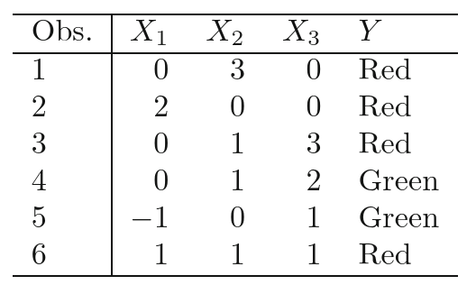

Actividad introductoria a Machine Learning
---
Proveer las respuestas a los puntos 1,2,5,6,7 de la sección 2.4 (página 52 del ISLRv2).

# Actividad 1
For each of parts (a) through (d), indicate whether we would generally expect the performance of a flexible statistical learning method to be better or worse than an inflexible method. Justify your answer.

## a. The sample size $n$ is extremely large, and the number of predictors $p$ is small.
	
Al tener un $n$ tan grande, podemos utilizar un **método flexible**. Esto es así ya que al tener tantas observaciones, se puede estimar $f$ minimizando el error.

## b. The number of predictors $p$ is extremely large, and the number of observations $n$ is small.
	
Como tenemos pocas observaciones y además muchas variables a tener en cuenta, lo mas probable es que tengamos una aproximación bastante pobre, por lo tanto seria correcto ser conservadores y utilizar un **método inflexible**.

## c. The relationship between the predictors and response is highly non-linear.
	
Al ser la relación de esta forma, es mejor utilizar un **método flexible**, ya que así se logrará una mejor estimación de $f$ que la que lograría un método inflexible, ya que estos últimos no logran describir de forma óptima comportamientos no-lineales.

## d. The variance of the error terms, i.e. $σ^2$ = Var( $\epsilon$ ), is extremely high.
	
Al tener tanta varianza en el error, no deberíamos arriesgarnos en utilizar un método flexible para aproximar $f$, ya que corremos el riesgo de que modelemos a $\hat{f}$ de tal manera que se vea influenciada por el 'ruido' introducido por la alta varianza. Por lo tanto, un **método inflexible** seria adecuado.

# Actividad 2
Explain whether each scenario is a classification or regression problem, and indicate whether we are most interested in inference or prediction. Finally, provide $n$ and $p$.

## a. We collect a set of data on the top 500 firms in the US. For each firm we record profit, number of employees, industry and the CEO salary. We are interested in understanding which factors affect CEO salary.

Problema de **regresión**, buscamos **inferir** los factores que afectan al salario, $n=500$, $p=3$.

## b. We are considering launching a new product and wish to know whether it will be a success or a failure. We collect data on 20 similar products that were previously launched. For each product we have recorded whether it was a success or failure, price charged for the product, marketing budget, competition price, and ten other variables.

Problema de **clasificación**, buscamos **predecir** si el producto será exitoso o no, $n=20$, $p=13$.

## c. We are interested in predicting the % change in the USD/Euro exchange rate in relation to the weekly changes in the world stock markets. Hence we collect weekly data for all of 2012. For each week we record the % change in the USD/Euro, the % change in the US market, the % change in the British market, and the % change in the German market.

Problema de **regresión**, buscamos **predecir** el porcentaje de variación, $n=52$, $p=3$.

# Actividad 5
## What are the advantages and disadvantages of a very flexible (versus a less flexible) approach for regression or classification? Under what circumstances might a more flexible approach be preferred to a less flexible approach? When might a less flexible approach be preferred?

En general, a medida que utilicemos métodos mas flexibles, la varianza aumentará mientras que el sesgo (bias) disminuirá.

Los métodos flexibles se adecuan mejor a relaciones no lineales; cuando la varianza es chica; o cuando el tamaño de la muestra es grande. En estos métodos, el riesgo de overfitting aumenta.

Por otro lado, los métodos inflexibles son preferibles en relaciones lineales; cuando la varianza es elevada; o el tamaño de la muestra es reducido.

# Actividad 6
## Describe the differences between a parametric and a non-parametric statistical learning approach. What are the advantages of a parametric approach to regression or classification (as opposed to a non-parametric approach)? What are its disadvantages?

Los métodos parametricos (inflexibles) se utilizan cuando se asume que la relación entre las variables es lineal, por lo que $\hat{f}$ puede tomar pocas formas. Es mas fácil de calcular y de interpretar (útil para inferir).

En cambio, los métodos no-paramétricos (flexibles) se utilizan cuando se asume que la relación entre las variables no es lineal, por lo que $\hat{f}$ puede tomar mayor cantidad de formas. Su calculo es mas complejo y el modelo difícil de interpretar (no es útil para inferir. tipo black-box). Además, existe el riesgo de overfitting.

# Actividad 7
The table below provides a training data set containing six observations, three predictors, and one qualitative response variable.

Suppose we wish to use this data set to make a prediction for $Y$ when $X1 = X2 = X3 = 0$ using K-nearest neighbors.

## a. Compute the Euclidean distance between each observation and the test point, $X1 = X2 = X3 = 0$.

$$
\begin{align}
d(T, 1) = \sqrt{(0 - 0)^2 + (0 - 3)^2 + (0 - 0)^2} = 3 \\
d(T, 2) = \sqrt{(0 - 2)^2 + (0 - 0)^2 + (0 - 0)^2} =2 \\
d(T, 3) = \sqrt{(0 - 0)^2 + (0 - 1)^2 + (0 - 3)^2} = \sqrt{10} \approx 3.16 \\
d(T, 4) = \sqrt{(0 - 0)^2 + (0 - 1)^2 + (0 - 2)^2} = \sqrt{5} \approx 2.24 \\
d(T, 5) = \sqrt{(0 + 1)^2 + (0 - 0)^2 + (0 - 1)^2} =\sqrt{2} \approx 1.41 \\
d(T, 6) = \sqrt{(0 - 1)^2 + (0 - 1)^2 + (0 - 1)^2} = \sqrt{3} \approx 1.73 \\
\end{align}
$$

## b. What is our prediction with $K = 1$? Why?

Para $K = 1$, la predicción para los valores dados es **$Y = Green$**, ya que tenemos en cuenta el valor de la observación mas cercana ( $Obs5=Green$ )

## c. What is our prediction with K = 3? Why?

Para $K = 3$, la predicción para los predictores dados es **$Y = Red$**, ya que tenemos en cuenta el valor de las tres observaciones mas cercanas ( $Obs5=Green$, $Obs6=Red$, $Obs2=Red$ ). Se escoge $Red$ ya que es el valor mas ocurrente en las observaciones.

## d. If the Bayes decision boundary in this problem is highly non-linear, then would we expect the best value for K to be large or small? Why?

En este caso, donde la frontera de decisión no es lineal, se esperaría que el valor de **$K$ fuese pequeño**, ya que así tendríamos un modelo mas flexible con capacidad de modelar formas de $f$ mas complejas.
