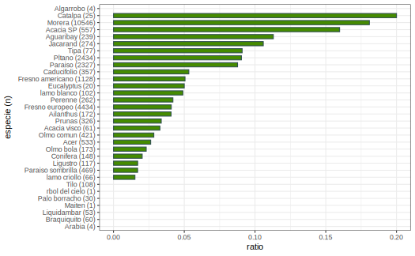

# Actividad 2

## Distribución de la clase `inclinacion_peligrosa`

Se observa que de las $25529$ observaciones del dataset `arbolado-publico-mendoza-2021-train.csv`, $22701$ ( $88,92$% ) corresponden a árboles que no presentan una inclinación peligrosa, los restantes $2828$ ( $11,08$% ) han sido etiquetados como peligrosos.

## Análisis por sección
Por cada sección, se calculó la proporción de árboles considerados peligrosos sobre el total de observaciones en la misma. Además, se agrega el número de observaciones de cada sección a su derecha.

Según lo observado, las secciones con mayor proporción de árboles con inclinación peligrosa son la 2 (Barrio Cívico) ( $15,38$% ) y la 3 (Parque O'Higgins) ( $14,87$% ).

Es importante remarcar que no se pueden realizar conclusiones respecto a la sección 11 (San Agustín), ya que la cantidad de árboles analizados es extremadamente pequeña ( $n=2$ ).

## Análisis por especie
Por cada especie, se calculó la proporción de árboles considerados peligrosos sobre el total de observaciones en la misma. Además, se agrega el número de observaciones de cada especie a su derecha.

Según lo observado, las especies con mayor proporción de árboles con inclinación peligrosa son Catalpa ( $20,00$% ), Morera ( $18,08$% ), Acacia SP ( $15,98$% ).

En el análisis, se excluyó a la especie Algarrobo, que obtuvo una proporción del ( $50$% ). Esto se debe a que la cantidad de observaciones de tal especie fue de ( $n=4$ ), muy pocas para realizar conclusiones. La falta de datos también esta presente en otras especies, como Árbol del cielo, Maiten, Arabia.

# Actividad 3

## Histograma de frecuencia para `circ_tronco_cm`
Se utilizó un ancho de bins igual a 10, ya que se observa en el dataset que las mediciones son aproximadas a múltiplos de 10.

## Histograma de frecuencia para `circ_tronco_cm`, diferenciando por `inclinación_peligrosa`.
En cada barra, se coloreó según la cantidad de árboles con inclinación peligrosa que conforman a la misma.

## Variable categórica `circ_tronco_cm_cat`
Para asignar la categoría a cada observación, el criterio de corte utilizado fue en calcular los cuartiles del dataset para confeccionar la siguiente tabla:

| Categoría | Valor  |
|-----------|--------|
| Muy alto  | >= 157 |
| Alto      | >= 110 |
| Medio     | >=  58 |
| Bajo      | >=   0 |
