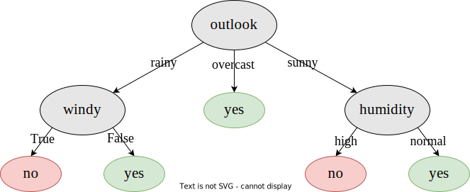

# Árboles de decisión

## 1\. Implementar un árbol de decisión y comprobar su funcionamiento

Se implementó el algoritmo pedido en Python, de acuerdo al pseudo-código provisto. Se ajustó en base al dataset `tennis.csv` y posteriormente se le solicitó que predijera la clase para los mismos datos.

El árbol de decisión obtenido es el siguiente:



La matriz de confusión fue la siguiente:

```
Confusion Matrix and Statistics

          Reference
Prediction FALSE TRUE
     FALSE     5    0
     TRUE      0    9
                                     
               Accuracy : 1          
                 95% CI : (0.7684, 1)
    No Information Rate : 0.6429     
    P-Value [Acc > NIR] : 0.002059   
                                     
                  Kappa : 1          
                                     
 Mcnemar's Test P-Value : NA         
                                     
            Sensitivity : 1.0000     
            Specificity : 1.0000     
         Pos Pred Value : 1.0000     
         Neg Pred Value : 1.0000     
             Prevalence : 0.6429     
         Detection Rate : 0.6429     
   Detection Prevalence : 0.6429     
      Balanced Accuracy : 1.0000     
                                     
       'Positive' Class : TRUE
```

## 2\. Estrategias de los árboles de decisión para datos de tipo real

Respecto a estas estrategias, se encuentran diferenciadas en función si serán aplicadas a los valores de entrada o de salida del árbol de decisión.

Si hablamos de valores de entrada, una buena forma para tratar con estos cuando son de tipo real es establecer *puntos de división* (split points), donde se efectuarán test de *desigualdad* en los nodos del árbol. Por ejemplo, un nodo podría comprobar si para un valor dado la altura es menor a 160 (Altura < 160), y en base a esa desigualdad, realizar la división. Existen métodos eficientes para encontrar buenos puntos de división.

En cambio, si quisiéramos tratar con valores de salida representándolos como valores continuos (por ejemplo: La predicción del precio de un departamento), necesitamos utilizar un *árbol de regresión*. Este tipo de árboles se diferencia de los árboles de clasificación en que en sus nodos hoja, en lugar de tener un único valor fijo, tienen una función lineal de un subconjunto de los atributos numéricos utilizados. Será tarea del algoritmo de aprendizaje decidir cuando dejar de dividir y comenzar a aplicar la regresión lineal.

